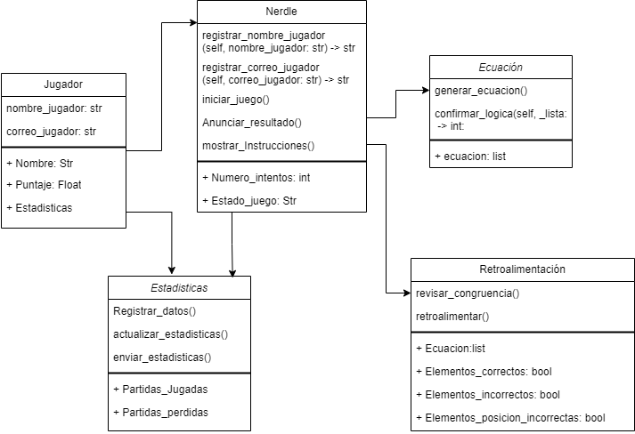

# Desarrollo del juego: Nerdle
## Integrantes 
#### Laura Bedoya Coronado
#### Sofia Lopera Diez 
#### Lenin Ospina Lamprea 
## Descripción del juego 

Nerdle es un juego de secuencias matemáticas en el que el jugador debe adivinar, en un número
limitado de intentos, una secuencia matemática que consta de números entre 0 y 9, operaciones
matemáticas básicas y el signo de igualdad. El juego proporciona retroalimentación después de
cada intento, lo que permite al jugador deducir la secuencia correcta.

### Reglas del juego: 
1. Secuencia Objetivo: En cada ronda, el juego selecciona cuidadosamente una secuencia de 8
elementos. Estos elementos pueden ser números del 0 al 9, operaciones matemáticas (+, -, *,
/) y el signo de igualdad (=).
2. Intentos Limitados: El jugador tiene un número máximo de intentos para adivinar la secuencia
de 8 elementos correcta. Generalmente se asigna un máximo de 6 intentos, pero este número
puede variar según la implementación del juego.
3. Adivinanzas: En cada intento, el jugador propone una secuencia de 8 elementos que cree que
coincide con la secuencia objetivo. Por ejemplo, una adivinanza podría ser "3 + 7 * 2 = 17".
4. Retroalimentación: Después de cada intento, el juego proporciona retroalimentación precisa
en tres categorías:
• Elemento correcto en la posición correcta: Indica cuántos elementos están en la
secuencia y en la posición correcta (marcadas en verde).
• Elemento correcto en la posición incorrecta: Muestra cuántos elementos están en la
secuencia, pero en la posición incorrecta (marcadas en amarillo).
• Elemento incorrecto: Informa cuántos elementos no están en la secuencia objetivo
(marcadas en gris).
5. Intentos restantes: El juego muestra el número de intentos restantes para motivar al jugador a
adivinar la secuencia antes de agotar los intentos disponibles.
6. Victoria o derrota: El jugador gana el juego si adivina la secuencia oculta dentro de los intentos
asignados. En caso contrario, si se agotan todos los intentos sin adivinar correctamente la
secuencia, se considera una derrota. En este último caso, el juego muestra cual era la
secuencia correcta.

Al finalizar, el jugador tiene la opción de iniciar un nuevo juego.
En cualquier momento, el jugador podrá ver las instrucciones del juego. Además, también deberá
tener la opción de ver las estadísticas del juego donde se le mostrará un gráfico con la distribución
de sus los intentos en cada juego realizado. El gráfico se debe poder enviar por correo electrónico.

## Modelo del mundo del problema 

## Modelo del mundo del problema con interfaz agregada
.png)

## Requisitos funcionales 

### R1 - Registrar jugador 
|                          |                                                                                                                                                                                                                                                                                                                   | 
|--------------------------|-------------------------------------------------------------------------------------------------------------------------------------------------------------------------------------------------------------------------------------------------------------------------------------------------------------------|
| Resumen                  | El sistema debe permitir registrar un jugador antes de iniciar la partida                                                                                                                                                                                                                                         | 
| Entradas                 | -	Nombre de usuario   -	Correo electrónico                                                                                                                                                                                                                                                                    |
| Resultado                | 1.	El sistema mostrará un cuadro donde se le pedirá el nombre de usuario y su correo electrónico para enviarle los datos de sus partidas   2.	El sistema le mostrará un menú con las opciones de comenzar juego y de ver las reglas del juego  3. El sistema mostrará un mensaje de bienvenida al usuario |
                                                                        

#### Descomposición del requisito
| Pasos                           | Métodos                          | Responsable     |
|---------------------------------|----------------------------------|-----------------|
| Registrar el nombre de usuario  | registrar_nombre_jugador()       | Nerdle          |
| Registrar el correo del usuario | registrar_correo_jugador()       | Nerdle          |
| Crear usuario                   | __init__(nombre_usuario, correo) | Jugador         |
| Ver instruciones                | mostrar_instrucciones()          | Jugador, Nerdle |

### R2 - Iniciar juego 
|            |                                                                                                                                                   | 
|------------|---------------------------------------------------------------------------------------------------------------------------------------------------|
| Resumen    | El sistema le va a permitir al usuario iniciar la partida                                                                                         | 
| Entradas   | -  No hay entradas                                                                                                                                | 
| Resultado  | 1.	El sistema mostrará una cuadrilla de 6X8 vacía   2.	El sistema escogerá una secuencia de 8 elementos, pero no se la mostrará al usuario    |
                                                          

#### Descomposición del requisito
| Pasos                                                        | Métodos            | Responsable |
|--------------------------------------------------------------|--------------------|-------------|
| Se inicia el juego                                           | Iniciar_juego()    | Ecuacion    |
| Se escoge una secuencia de elementos, oculta para el jugador | Generar_ecuacion() | Ecuación    |

### R3 - Hacer jugada 
|              |                                                                                                                                                                                                                                                                                                                                                                                                                                                                                                                                                                                                                                                                                                                                                                                                                                                                                                                                                                                                          | 
|--------------|----------------------------------------------------------------------------------------------------------------------------------------------------------------------------------------------------------------------------------------------------------------------------------------------------------------------------------------------------------------------------------------------------------------------------------------------------------------------------------------------------------------------------------------------------------------------------------------------------------------------------------------------------------------------------------------------------------------------------------------------------------------------------------------------------------------------------------------------------------------------------------------------------------------------------------------------------------------------------------------------------------|
| Resumen      | El sistema le permitirá al usuario jugar hasta que quede sin intentos que le permitan seguir jugando                                                                                                                                                                                                                                                                                                                                                                                                                                                                                                                                                                                                                                                                                                                                                                                                                                                                                                     | 
| Entradas     | -	Ecuación ingresada por el usuario                                                                                                                                                                                                                                                                                                                                                                                                                                                                                                                                                                                                                                                                                                                                                                                                                                                                                                                                                                      | 
| Resultado    | 1.	El sistema permitirá que el jugador ingrese los elementos que encuentre pertinentes en las casillas correspondientes   2.	El sistema comparará los elementos dados por el usuario con la secuencia original   3.	El sistema pintará cada cuadro de la cuadrilla según corresponda. 3.1.	Si el elemento de la cuadrilla esta correcto y en la posición correcta se pintara el cuadro de color verde  3.2.	Si elemento de la cuadrilla está correcto, pero está en la posición incorrecta se pintará el cuadro de color amarillo   3.3.	Si elemento de la cuadrilla es incorrecto se pintará el cuadro de color gris. 4.	Se confirman los intentos restantes   4.1.	Si el jugador adivina la secuencia entre los intentos restantes el sistema mostrará un mensaje indicando que ha ganado el juego  4.2.	Si el jugador no adivina la secuencia y se le acaban los intentos restantes el sistema le mostrará un mensaje indicando que ha perdido   5.	 Se ejecuta el R4 |

#### Descomposición del requisito
| Pasos                                                                                   | Métodos                                  | Responsable       |
|-----------------------------------------------------------------------------------------|------------------------------------------|-------------------|
| Se comprueba si la secuencia o ecuación tiene congruencia                               | Revisar_congruencia()                    | Retroalimentacion |
| Comparar la secuencia original con lo ingresado por el usuario                          | Comparar_ecuaciones(elementos, ecuación) | Nerdle            |
| El sistema verificara los elementos atreves de la retroalimentación                     | Retroalimentar()                         | Retroalimentacion |
| Si el elemento es correcto, en la posición   correcta se pintara de verde           | Elementos_correctos() -> bool            | Retroalimentacion |
| Si el elemento es correcto,   pero en la posición incorrecta se pintara de amarillo | Elementos_posición_incorrectos() -> bool | Retroalimentacion |
| Si el elemento es incorrecto, se pintara de gris                                        | Elementos_incorrectos() -> bool          | Retroalimentacion |
| Se revisan los intentos restantes                                                       | Numero_intentos()                        | Nerdle            |
| Se mostrara la secuencia original                                                       | Mostrar_secuencia()                      | Ecuación          |

### R4 - Finalizar juego
|           |                                                                                                                                                                                                                                         | 
|-----------|-----------------------------------------------------------------------------------------------------------------------------------------------------------------------------------------------------------------------------------------|
| Resumen   | El sistema le permitirá salir de la partida al jugador en cualquier momento                                                                                                                                                             | 
| Entradas  | -	No hay entradas                                                                                                                                                                                                                       | 
| Resultado | 1.	El sistema le mostrara la secuencia correcta   2.	Se mostrarán y almacenarán las estadísticas del juego (se llama el requisito R5)   3.	El sistema le mostrara un menú con las opciones de jugar de nuevo o salir del juego. |

#### Descomposición del requisito
| Pasos                            | Métodos                      | Responsable |
|----------------------------------|------------------------------|-------------|
| Se verifica si el jugador gano   | anunciar_resultado() -> bool | Nerdle      |
| se mostrará la ecuación correcta | mostrar_ecuacion()           | Ecuacion    |

### R5 - Cargar estadísticas 
|           |                                                                                                                                                                                                                                                                                                                                                                                       | 
|-----------|---------------------------------------------------------------------------------------------------------------------------------------------------------------------------------------------------------------------------------------------------------------------------------------------------------------------------------------------------------------------------------------|
| Resumen   | El sistema guardara las estadísticas del juego al jugador                                                                                                                                                                                                                                                                                                                             | 
| Entradas  | -	No hay entradas                                                                                                                                                                                                                                                                                                                                                                     | 
| Resultado | 1.	El jugador podrá acceder a estas estadísticas por medio de un menú   2.	El sistema previamente almacenará la información de las partidas realizadas   3.	El jugador al darle a la opción de estadísticas verá un gráfico que representará sus partidas   4.	En las estadísticas se encontrará la opción de enviar los resultados por medio del correo registrado en R1 |

#### Descomposición del requisito
| Pasos                                                                             | Métodos                   | Responsable  |
|-----------------------------------------------------------------------------------|---------------------------|--------------|
| Se almacenara la información de las partidas realizadas                           | Registrar_datos()         | Estadísticas |
| Se actualiza el grafico de las estadísticas, según la informacion de las partidas | Actualizar_estadisticas() | Estadísticas |
| Se enviaran las estadísticas al correo del jugador                                | enviar_estadisticas()     | Estadísticas |
